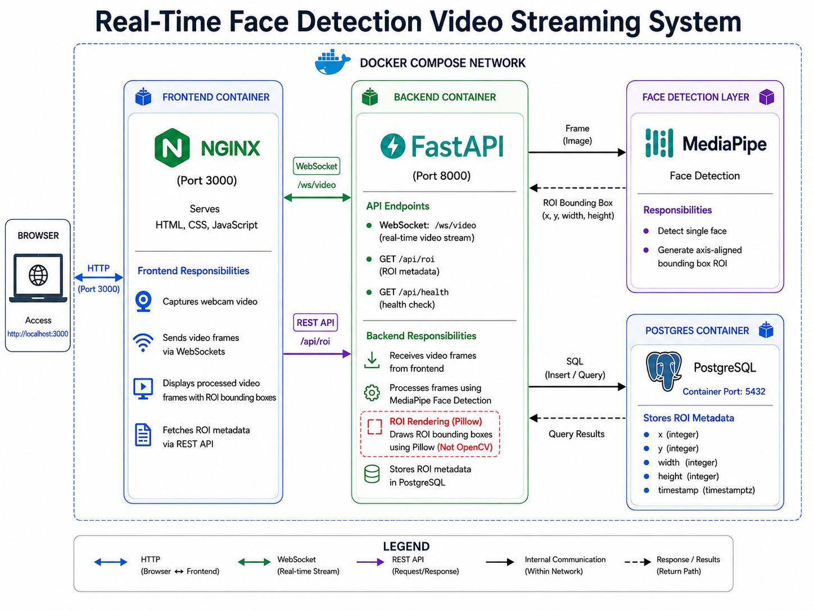
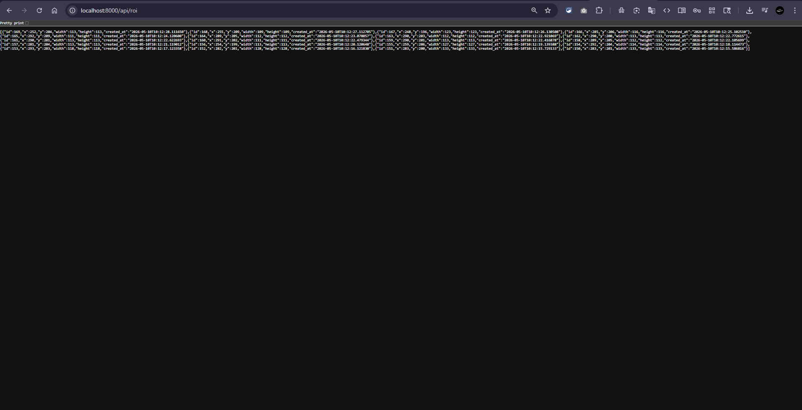
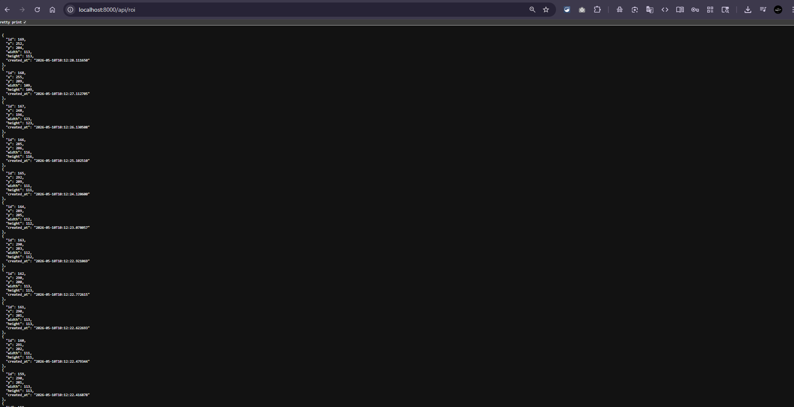
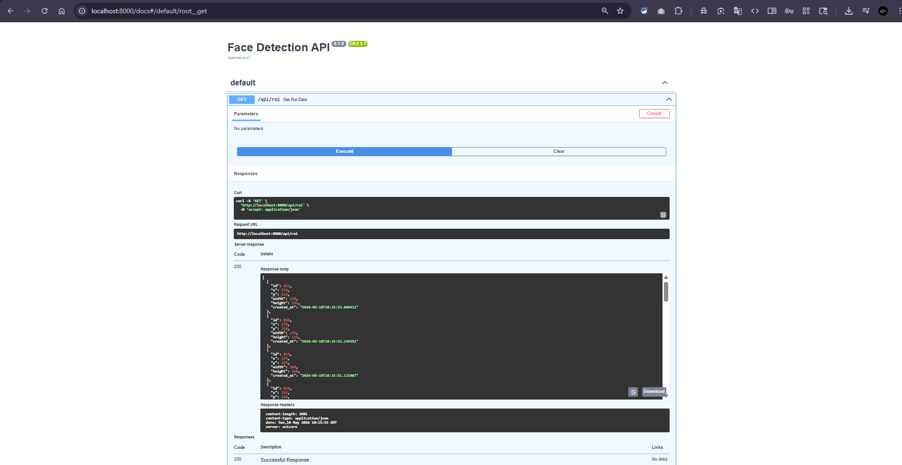
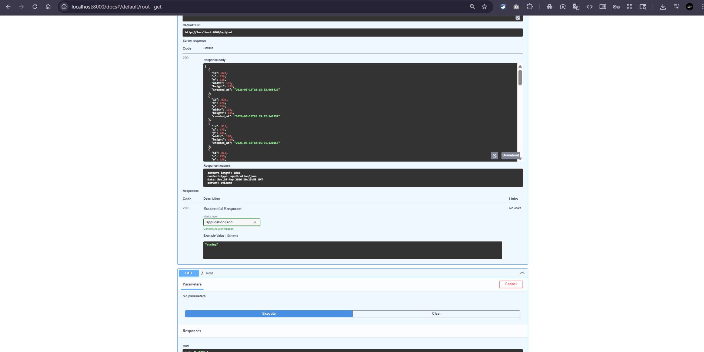
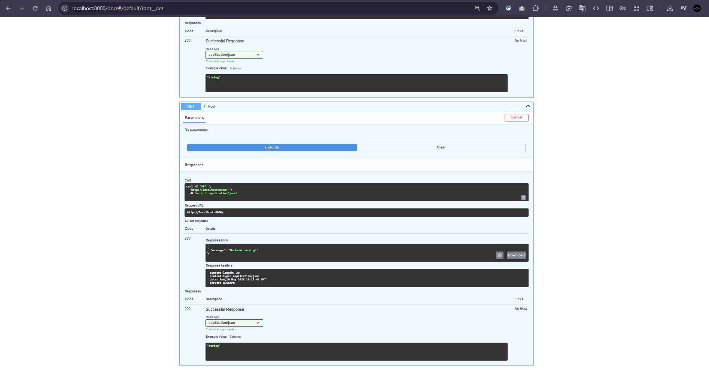

# Real-Time Face Detection Video Streaming System

## Overview

A containerized real-time face detection and video streaming platform built using FastAPI, WebSockets, MediaPipe, PostgreSQL, Docker, and a lightweight HTML/CSS/JavaScript frontend.

This project was developed as part of the Mega AI Backend Engineering Internship Assignment.

The system captures webcam frames from the browser, streams them to a FastAPI backend using WebSockets, detects faces in real time using MediaPipe, generates an axis-aligned ROI (Region of Interest) bounding box, draws the ROI on the frame without using OpenCV drawing utilities, stores ROI metadata in PostgreSQL, and streams the processed frames back to the frontend.

The complete system is containerized using Docker Compose.

---

# Features

* Real-time webcam video streaming
* Bidirectional WebSocket communication
* Face detection using MediaPipe
* ROI (Region of Interest) extraction
* Axis-aligned minimal bounding box generation
* ROI rendering using Pillow (without OpenCV drawing)
* PostgreSQL ROI metadata persistence
* REST API endpoints for ROI retrieval
* Health check endpoint
* Dockerized multi-container architecture
* Nginx-served frontend
* Automated API testing with pytest
* Clean service-oriented backend structure

---

# Tech Stack

| Layer                  | Technology            |
| ---------------------- | --------------------- |
| Backend Framework      | FastAPI               |
| Realtime Communication | WebSockets            |
| Face Detection         | MediaPipe             |
| Image Processing       | Pillow                |
| Database               | PostgreSQL            |
| ORM                    | SQLAlchemy            |
| Frontend               | HTML, CSS, JavaScript |
| Frontend Server        | Nginx                 |
| Containerization       | Docker                |
| Orchestration          | Docker Compose        |
| Testing                | Pytest                |

---

# System Architecture

The application is composed of three primary services:

1. Frontend Container
2. Backend Container
3. PostgreSQL Database Container

The browser captures webcam frames and sends them to the backend over a WebSocket connection. The backend processes frames using MediaPipe face detection, generates ROI metadata, draws ROI bounding boxes using Pillow, stores ROI metadata inside PostgreSQL, and returns processed frames back to the frontend.

The frontend also periodically queries the REST API to fetch the latest ROI metadata.

---

# Architecture Diagram



---

# Project Structure

```text
Face-detector/
│
├── backend/
│   ├── app/
│   │   ├── api/
│   │   ├── db/
│   │   ├── models/
│   │   ├── services/
│   │   ├── utils/
│   │   ├── websocket/
│   │   └── main.py
│   │
│   ├── models/
│   │   └── blaze_face_short_range.tflite
│   │
│   ├── requirements.txt
│   ├── Dockerfile
│   ├── test_api.py
│   └── .env
│
├── frontend/
│   ├── index.html
│   ├── style.css
│   ├── script.js
│   └── Dockerfile
│
├── media/
│   ├── architecture.png
│   ├── docker container.png
│   ├── frontend 1.png
│   ├── frontend 2.png
│   ├── roi_api1.png
│   ├── roi_api2.png
│   ├── swagger1.png
│   ├── swagger2.png
│   └── swagger3.png
│
├── docker-compose.yml
└── README.md
```

---

# API Endpoints

## WebSocket Endpoint

### `WS /ws/video`

Handles:

* Receiving realtime webcam video frames
* Streaming processed frames back to frontend
* ROI generation
* ROI rendering
* Frame processing pipeline

### Why WebSockets?

WebSockets were chosen because they provide low-latency bidirectional communication ideal for realtime video streaming systems.

Instead of separate upload and retrieval endpoints, a single persistent WebSocket connection handles:

* Client → Server frame transmission
* Server → Client processed frame streaming

This reduces overhead and improves realtime responsiveness.

---

## ROI API Endpoint

### `GET /api/roi`

Returns recently stored ROI metadata.

### Example Response

```json
[
  {
    "id": 60,
    "x": 250,
    "y": 264,
    "width": 95,
    "height": 95,
    "created_at": "2026-05-10T09:13:19.085668"
  }
]
```

---

## Health Check Endpoint

### `GET /api/health`

### Example Response

```json
{
  "status": "healthy",
  "service": "face-detection-api"
}
```

---

# ROI Data Model

The PostgreSQL database stores ROI metadata for detected faces.

## Stored Fields

| Field      | Type      |
| ---------- | --------- |
| id         | Integer   |
| x          | Integer   |
| y          | Integer   |
| width      | Integer   |
| height     | Integer   |
| created_at | Timestamp |

---

# Face Detection Pipeline

## Step 1 — Webcam Capture

The browser accesses the webcam using the MediaDevices API.

## Step 2 — Frame Encoding

Frames are captured from an HTML canvas and encoded as Base64 JPEG images.

## Step 3 — WebSocket Transmission

Encoded frames are transmitted to the FastAPI backend through a persistent WebSocket connection.

## Step 4 — Frame Decoding

The backend decodes incoming Base64 image frames.

## Step 5 — Face Detection

MediaPipe detects a single face and generates an axis-aligned bounding box ROI.

## Step 6 — ROI Rendering

Bounding boxes are rendered using Pillow.

OpenCV drawing utilities were intentionally avoided to comply with assignment requirements.

## Step 7 — Database Persistence

ROI metadata is stored inside PostgreSQL.

## Step 8 — Processed Frame Streaming

Processed frames are streamed back to the frontend.

---

# Docker Architecture

The entire application is containerized using Docker Compose.


## Containers

| Container | Responsibility                      |
| --------- | ----------------------------------- |
| frontend  | Nginx frontend server               |
| backend   | FastAPI realtime processing service |
| db        | PostgreSQL database                 |

---

# Running the Project

## Prerequisites

Install:

* Docker
* Docker Compose

---

# Local Development Setup

## Backend Setup

```bash
cd backend

python -m venv .venv

.venv\Scripts\activate

pip install -r requirements.txt
```

---

## Frontend Setup

Open:

```text
frontend/index.html
```

or use Live Server.

---

# Docker Setup

## Build and Start Containers

```bash
docker compose up --build
```

---

## Application URLs

### Frontend

```text
http://localhost:3000
```

### Backend

```text
http://localhost:8000
```

### Swagger Documentation

```text
http://localhost:8000/docs
```

### ROI API

```text
http://localhost:8000/api/roi
```

---

# Environment Variables

## backend/.env

```env
DATABASE_URL=postgresql://postgres:postgres@db:5432/facedb
```

---

# Testing

Basic API tests were implemented using pytest.

## Run Tests

```bash
cd backend

pytest
```

---

# Test Coverage

Implemented tests include:

* Health endpoint test
* ROI endpoint test

---

# Screenshots

## Frontend UI


---

## ROI API Response





---

## Swagger Documentation







---

## Docker Containers


---

# Performance Considerations

Several optimizations were implemented:

* ROI database writes are throttled to reduce excessive inserts
* WebSockets minimize HTTP overhead
* Lightweight frontend architecture avoids unnecessary frontend frameworks
* Dockerized deployment ensures environment consistency

---

# Security Considerations

Basic backend security practices implemented:

* Environment variable-based configuration
* Containerized service isolation
* CORS configuration
* Structured API separation
* Controlled database access through backend service layer

---

# Error Handling

Implemented error handling includes:

* WebSocket exception handling
* Database connection validation
* Invalid image frame handling
* Graceful WebSocket shutdown
* Backend health endpoint monitoring

---

# Engineering Decisions

## Why FastAPI?

FastAPI provides:

* excellent async performance
* native WebSocket support
* automatic OpenAPI documentation
* lightweight architecture
* strong backend engineering ergonomics

---

## Why WebSockets Instead of REST Streaming?

Realtime video streaming requires low-latency bidirectional communication.

WebSockets eliminate repeated HTTP request overhead and are significantly better suited for realtime frame streaming.

---

## Why MediaPipe?

MediaPipe provides:

* lightweight realtime face detection
* strong CPU performance
* easy deployment
* efficient inference for webcam streaming applications

---

## Why Pillow Instead of OpenCV Drawing?

The assignment explicitly prohibited OpenCV-based ROI rendering.

Therefore, Pillow was used to draw bounding boxes while still leveraging MediaPipe for detection.

---

# Future Improvements

Potential future enhancements:

* Multi-face detection support
* Authentication and authorization
* Redis-based frame queueing
* Async database writes
* GPU acceleration
* Video recording support
* Historical ROI analytics dashboard
* Kubernetes deployment
* CI/CD integration
* Prometheus monitoring

---

# AI Usage Disclosure

AI tools were used during development for:

* Docker and container debugging
* MediaPipe compatibility troubleshooting
* FastAPI and WebSocket implementation guidance
* architecture planning
* debugging assistance
* documentation refinement

All final integration, testing, debugging, architectural decisions, and system validation were manually performed and verified by the developer.

---

# Author

@insomniac1712
Devarshi Mani Tripathi


